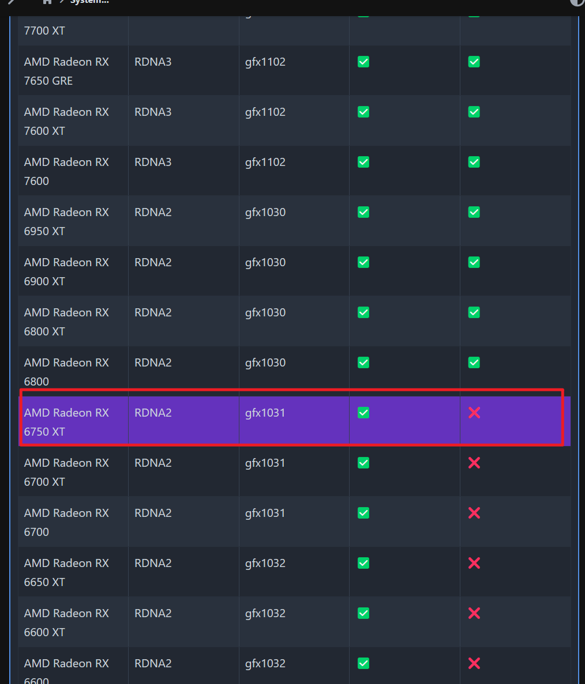

跑大模型分为CPU模式和GPU模式。CPU模式下占用CPU和内存，GPU模式下占用GPU和GPU显存。在CPU模式下大模型的速度显著慢于GPU模式，7b模型回答一个比较长的问题需要花2分钟甚至超时，并发效率差。在复杂问题或者AI agent等场景下，须使用GPU模式，否则几乎不可用。

## 一、查看显卡是否支持HIP SDK

打开https://rocm.docs.amd.com/projects/install-on-windows/en/develop/reference/system-requirements.html查看是否支持

刚好我的6750系显卡不支持

## 二、安装HIP SDK

没有官方HIP SDK的情况下，按照https://github.com/likelovewant/ollama-for-amd/releases的方法一步步操作即可，其实就是替换一下文件就行了

