## 来源安全

### 总结

- 目前最安全：SafuSkill。它的扫描维度最聚焦安全本身，且有专业安全公司背书，但是可能存在安全要求比较苛刻的情况
- 追求技能数量和生态：首选ClawHub。作为源头市场，最新、最全的技能一般首先在这里发布。借助生态和资源，安全性也在不断提高
- 非热门技能使用率低且无法访问国外网络：腾讯Skillhub

### Skills市场

#### [ClawHub](https://clawhub.ai)

收录3.35万个skill

虽然支持通过"Hide suspicious"隐藏可疑skill，但是官方并没有足够信心宣称是安全的，这部分skill中存在”扫描结果无风险但置信度低的skill“。因此，建议在筛选非可疑skill的基础上，仅针对结果置信度高的skill列为安全skill

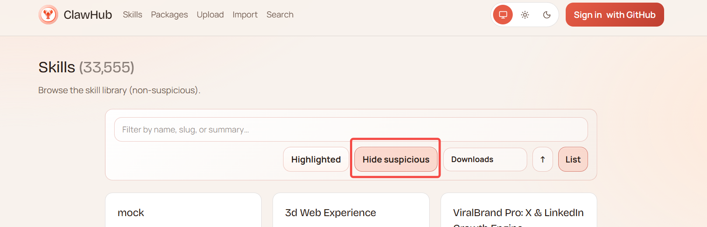

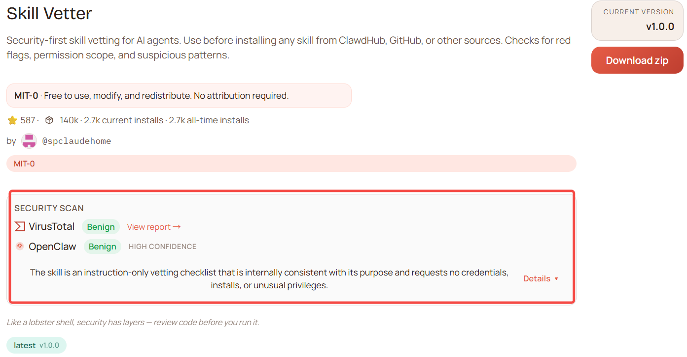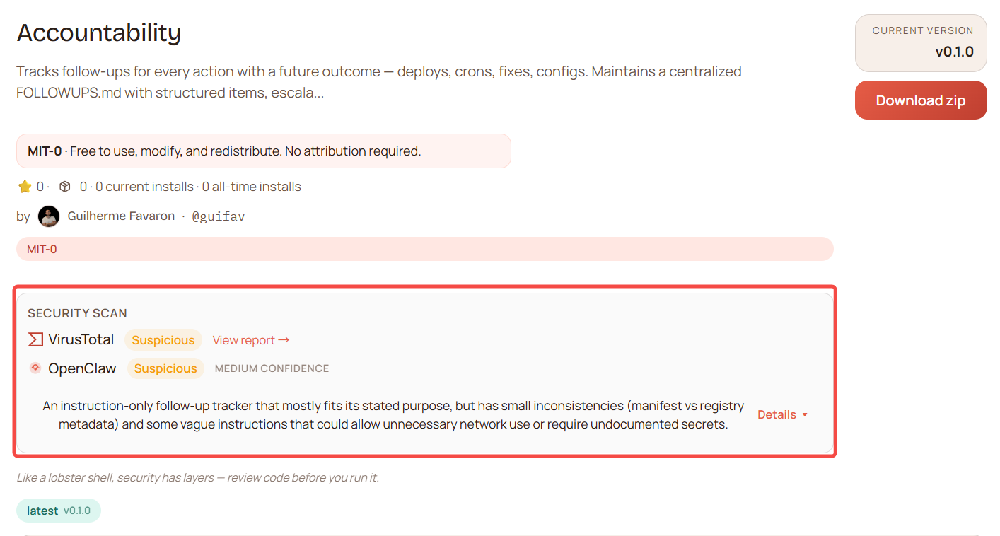

#### [Skillhub](https://www.skillhub.club)

收录3.49万个skill

skillhub的openclaw导航栏是skillhub跟clawhub合作的模块，该模块下的skills可以选择经过官方认证或扫描的安全skills。其中，官方认证指的是”Clawhub“的官方认证，安全扫描使用的工具也跟clawhub相同

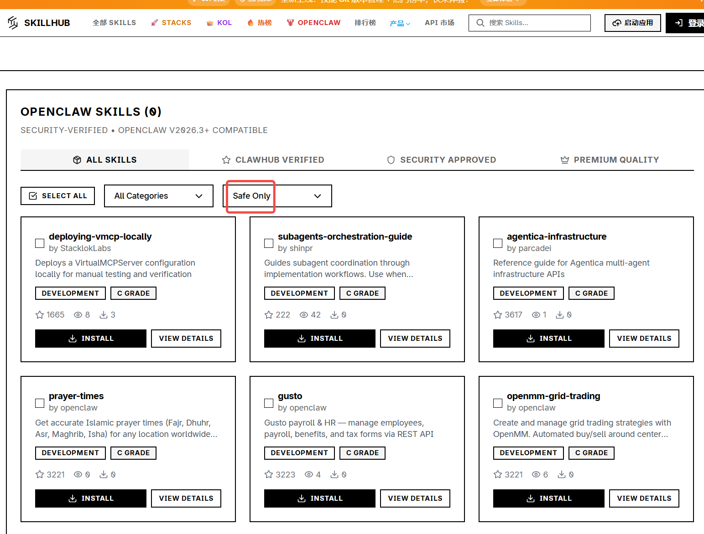

#### [Safuskill](https://safuskill.ai/)

口号是专门提供安全Skill，但本质也是通过扫描评分的方式来评估安全性，而非仅提供安全skill，因此同步时也仍需做筛选判断

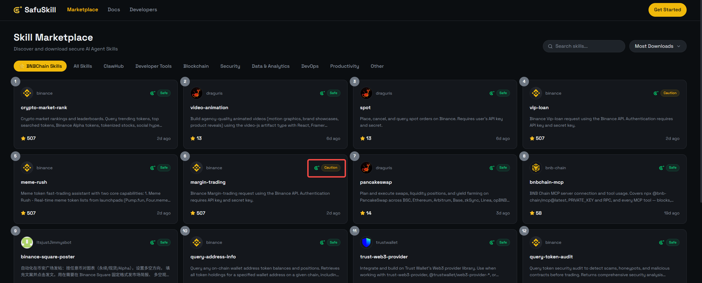

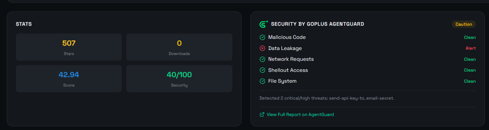

#### [腾讯Skillhub](https://skillhub.tencent.com)

收录来自ClawHub的2.5万个skill，宣传是”ClawHub的中国镜像“，但**只承诺TOP50榜单经过官方认证和扫描**，未声明是不是只收录ClawHub中经过安全扫描且置信度高的skill，因此可认为TOP50之外的skill并不承诺安全性

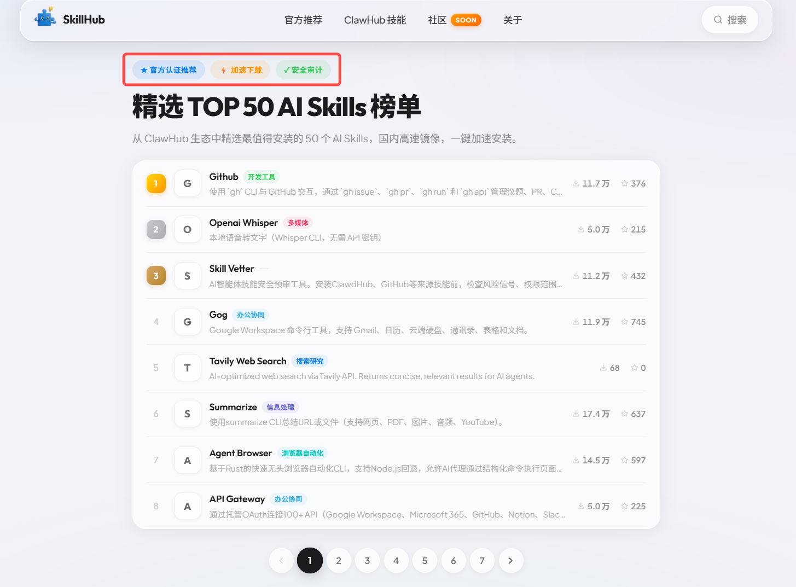

#### 不提供安全检查或承诺的其他主要市场

- 字节[Find Skill](https://findskill.com/)

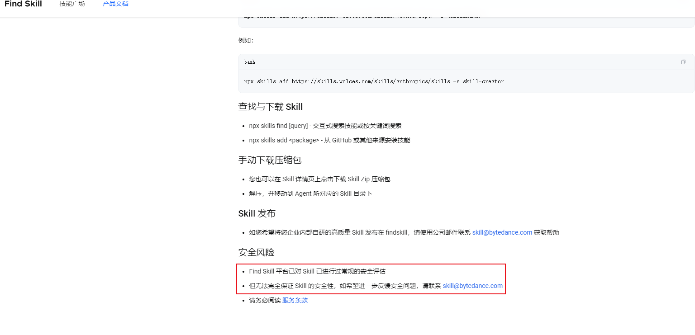

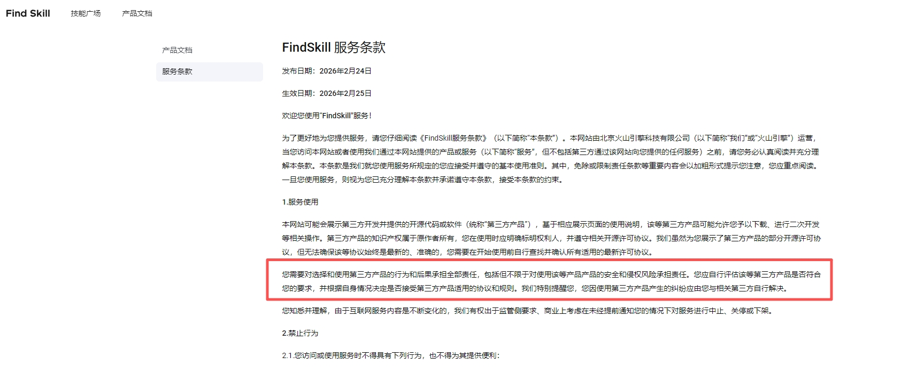

- skillsmp：主要提供manus这类隔离的agent使用，不提供安全扫描

### Skills仓库

Anthropic官方：https://github.com/anthropics/skills

Awesome Claude Skills（社区精选）：https://github.com/ComposioHQ/awesome-claude-skills

## 安全检查

### vetter

vetter是一个用于检查skill是否安全的skill，基本上与ClawHub的检查结果接近，主要用于进一步确认安全或者检查直接通过文件传输过来的skill

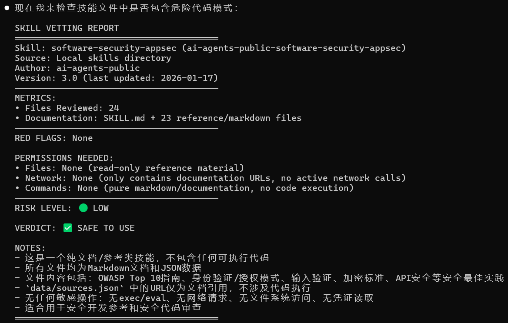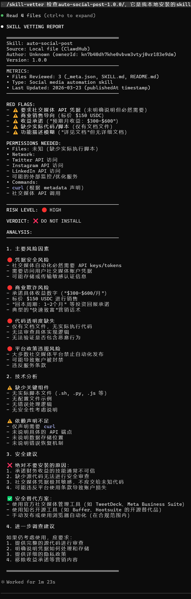
