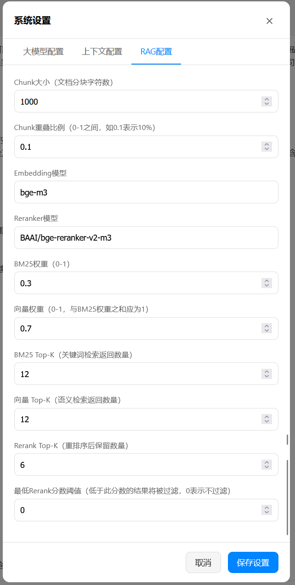
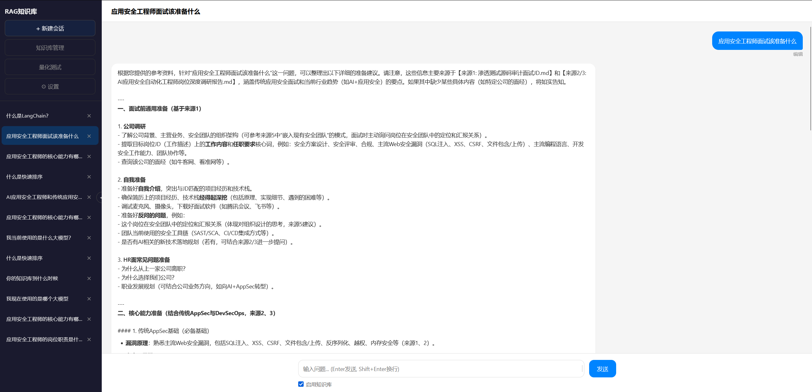
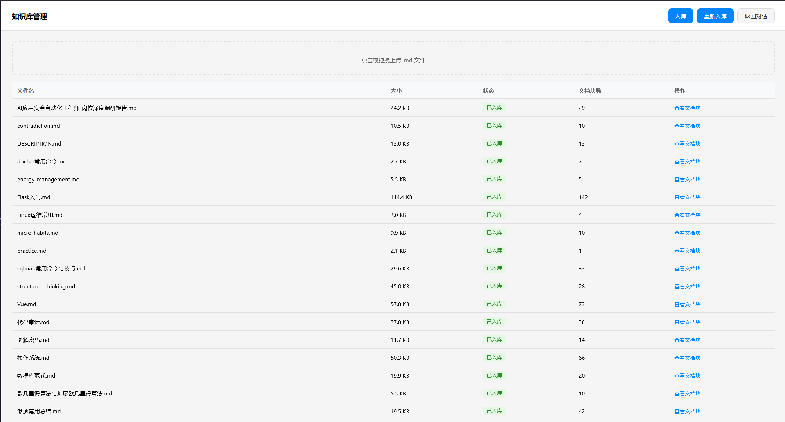
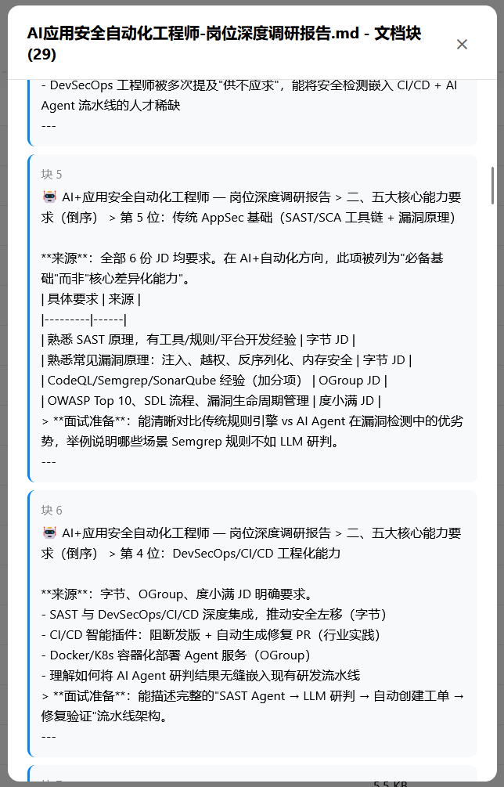
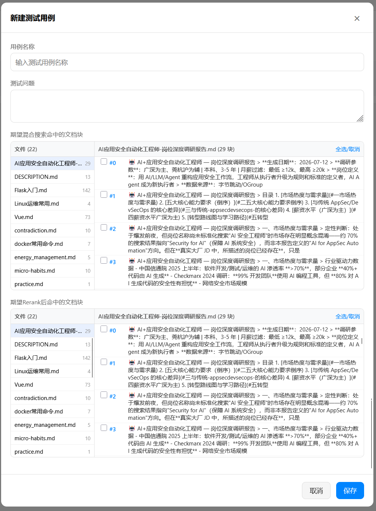
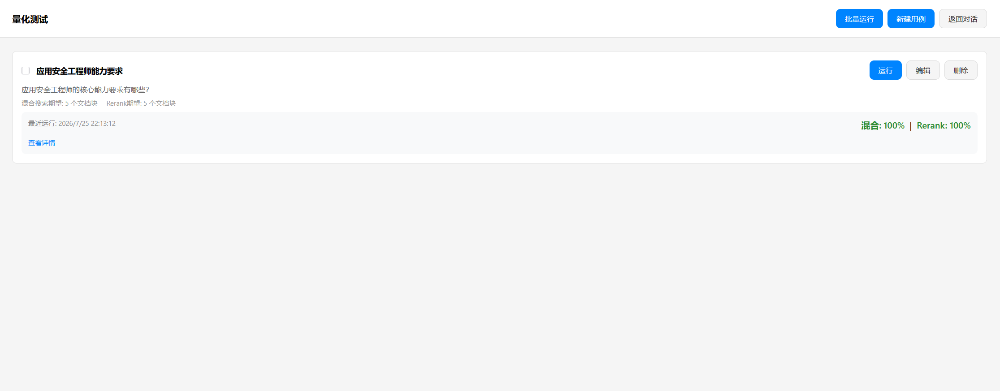
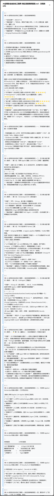

## 背景

为了构建自己的核心技术能力，我针对RAG发出一次实践挑战，目标是"基于LangChain打造简单的个人学习笔记RAG知识库"。我在五天时间内，通过之前对RAG的理论了解，再充分针对RAG流程进行总结后，使用vibe coding的方式完成了这个项目。也许并不完美，但是在实践中得到的经验是比理论知识更加深刻的。

## 项目介绍

正如前面所说，这个项目完全是我在学习的过程中为个人打造的，因此功能局限性可能会比较强，以下介绍其主要功能或特性。

### 核心 RAG 能力

- **混合检索**：BM25 关键词匹配 + 向量语义匹配，双路召回后融合排序
- **Rerank 重排序**：使用 CrossEncoder（BAAI/bge-reranker-v2-m3）对候选文档二次精排
- **中文支持**：jieba 分词优化中文检索效果
- **Query 改写**：结合对话历史，用 LLM 将用户问题改写为更适合检索的查询

### RAG 全链路配置

- **Chunking 策略**：Markdown Header 切分 + 字符数二次切分。这里考虑到我的个人知识库都是采用的markdown格式为主，因此不采用常见的通用文档chunking策略，而是针对Markdown的特点进行chunking
- **Chunk 大小**可配置（默认 1000 字符）：尝试过 500 字符，发现对于很多内容来说，500字符往往不够而1000字符是足够的，并且对于大的文章内容也不会切分太多快导致rerank的结果中难以覆盖需要的所有知识，因此暂时设置1000是我的最佳，之后遇到有问题再做调整
- **Chunk 重叠比例**可配置（默认 10%，按比例计算）：非常常见的一种策略，没什么好说的
- **Embedding 模型**配置（Ollama bge-m3）：很重要。我一开始使用的模型在中文语境下表现不好，一度以为是项目的问题，后面确认项目正常，引入了量化测试，换了模型后测试发现是模型的问题
- BM25 / 向量检索各自 Top-K 配置
- Rerank 模型配置（BAAI/bge-reranker-v2-m3）
- Rerank Top-K 配置、最低相似度阈值配置

### 对话界面

- 左侧会话列表 + 右侧对话详情布局
- 左侧栏支持点击收起/展开
- 对话时可勾选是否启用知识库（关闭后为纯对话模式）
- 支持重新编辑用户问题并重新生成回答
- 支持一键复制 LLM 回答内容（不含数据来源）
- 流式输出、引用来源展示

### 知识库管理

- 界面左侧入口进入知识库管理页面
- 支持通过界面上传 .md 文件
- 文档入库：会标记当前文档状态（已入库 / 未入库），支持一键入库或者所有文档进行重新入库，是一个非常使用的功能，在新增文档或者修改chunking相关配置时会很有用
- 查看每个文档的 RAG 切分结果（各文档块内容）：是进行初步验证的辅助功能，能看到chunking结果是否符合预期

### 量化测试

在AI时代，量化测试愈发重要，知识库的测试相对没那么复杂，是具备幂等性的，只需要测试单次的混合搜索和rerank的结果是否符合预期就行。进一步地，还可以针对BM25和embedding余弦相似度的结果做进一步验证，这里我觉得没必要，就只保留了混合搜索和rerank。

- 通过界面配置测试用例：问题 + 期望命中的文档块集合
- 支持选择测试次数，保存测试结果
- 测试结果包含：每次命中的文档块 ID、命中率
- 支持勾选多个测试用例并行执行

### 会话管理

- 会话持久化（本地 JSON 文件存储）
- 会话列表展示、新建、删除
- 自动用首条消息生成会话标题

> 我暂时觉得没必要上智能压缩和长期记忆，这两部分是没有添加的

## RAG流程

### 知识入库

1. 导入文档
2. 根据chunking策略对文档进行切块
3. 针对每一个文档块，调用embedding模型进行向量化，并存储到向量数据库（如chroma）

### 用户查询

1. 输入问题
2. LLM根据对话历史和输入问题，输出一个用于混合检索的查询问题
3. 进行混合检索，包括BM25和余弦相似度两方面。在这个过程，两方面会单独召回指定数量的文档块，然后去重合并
4. 调用rerank进一步检查，为每个文档块进行相似度赋分，并取前N个文档块作为最终的引用来源参考
5. 将用户对话历史、用户问题和引用来源进行组装，调用LLM进行回答

## 建设过程的心得

### 优秀的chunking策略能事半功倍

通用的chunking策略往往是采用固定大小快，或者按照段落为基本单位并设置最大字符大小的组合来切块。这种切法的语义性往往效果不好，导致文档块的内容残缺，进而导致召回的结果不完整，回答自然就不对。

由于我的笔记基本上都是markdown格式，因此我直接以标题作为切块的依据，识别1-3级标题，再辅以最大字符大小的组合进行切块，并且在每个文档块中拼接目录层级，具体如下图所示。这种切法尽可能完整的保留语义性，只要文档是标准的，那么效果就完全符合预期。

作为对比，我尝试了RAGFlow默认配置下通用切片同样的笔记，效果就非常差。例如，提问"应用安全工程师的核心能力有哪些？"的时候，RAGFlow只能回答到2-3个。只有明确提问"应用安全工程师的五大核心能力有哪些？"时才能得到4-5个能力的答案，语义表现非常差。

### 选择合适的模型

千万不要轻视模型的重要性。在最早的时候，我使用了nomic-embed-text作为embedding模型，但是在中文语境下表现很差，导致向量余弦相似度的结果完全不符合预期，甚至一度以为是chunking结果不行。

后面搜索了相关模型，最终决定embedding和reranker模型都使用BAAI的模型，分别是bge-m3和bge-reranker-v2-m3，这才使得整个表现完美符合我当前的需求。

### 可量化的测试才可靠

如果缺少可量化测试，至少会发生以下问题

- 无从知道引用的文档块是不是符合预期的，叠加上LLM的调用，会导致完全不知道LLM的回答是否准确和正确，知识库就失去意义了
- 每次chunking策略、模型配置、RAG配置进行调整后，都要重新进行手动测试，以验证调整或者优化后的知识库系统是否能符合预期