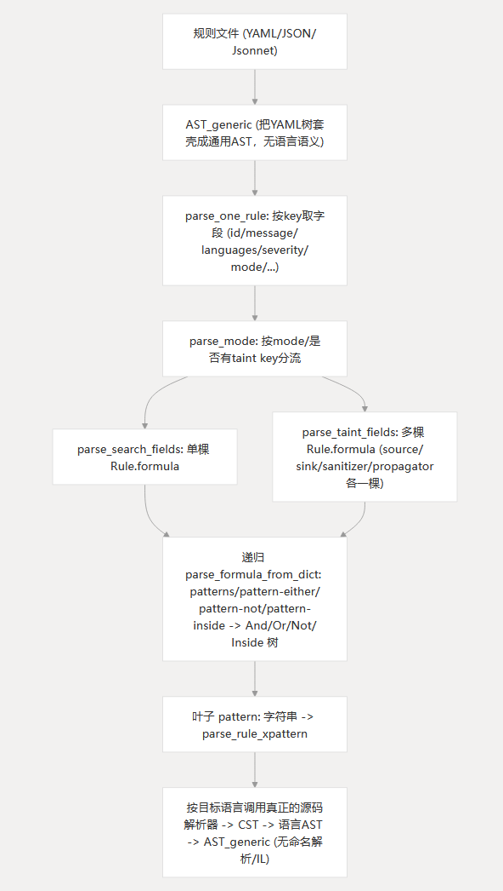

## 将源码转化为通用AST

> 目标：将源码转化为统一表示的通用AST

### 1. 源码 -> CST

在这一步中，会先经过tree-sitter或Semgrep自己的Pfff作为解析器，将源码转化为CST。

> 注意：CST 由 `ocaml-tree-sitter` 根据各语言的 grammar 自动生成 OCaml 类型。因此，使用`semgrep show dump-cst`得到的结果，会与直接使用tree-sitter项目得到的结果不同。差异点主要来自日志打印的格式和semgrep为了自己特殊语法而实现的grammar

使用semgrep提供的命令`semgrep show dump-cst <lang> <file>`可以查看CST信息。例如，对于Python的`print("hello")`得到的结果如下。可以看到，CST相比AST的特点就是保留了`(`、`)`、`"`等源码特征

```
[
  Simple_stmts (
    (
      Exp_stmt (
        Exp (
          Prim_exp (
            Call (
              (
                Choice_choice_print (
                  Choice_print (
                    Print "print"
                  )
                )
                Arg_list (
                  (
                    "("
                    Some (
                      Exp (
                        Prim_exp (
                          Str (
                            (
                              "\""
                              [
                                Str_content (
                                  [
                                    Str_content_ "hello"
                                  ]
                                )
                              ]
                              "\""
                            )
                          )
                        )
                      )
                      []
                    )
                    None
                    ")"
                  )
                )
              )
            )
          )
        )
      )
      []
      None
      ""
    )
  )
]
```

### 2. CST -> 语言特定AST（可选层）  

这一步的目的是去除语法糖。以Java为例，以下方法是将几个特殊类型转化为`TBasic`统一表示

```ocaml
let integral_type (env : env) (x : CST.integral_type) =
  match x with
  | `Byte tok -> TBasic (str env tok) (* "byte" *)
  | `Short tok -> TBasic (str env tok) (* "short" *)
  | `Int tok -> TBasic (str env tok) (* "int" *)
  | `Long tok -> TBasic (str env tok) (* "long" *)
  | `Char tok -> TBasic (str env tok) (* "char" *)
```

### 3. CST/语言特定AST -> 通用AST(AST_generic)

Semgrep支持几十种语言，因此最终需要统一转化为通用AST，再进行匹配。还是以`print("hello")`为例，使用`semgrep show dump-ast <lang> <file>`就能得到通用的AST结果，如下所示。其中，Id信息有很多字段还是空的（如`id_resolved`、`id_type`），需要等到命名解析后才填充完成。

```
Pr(
  [ExprStmt(
     Call(
       N(
         Id(("print", ()),
           {id_info_id=1; id_flags=Ref(0); id_resolved_alternative=Ref(
            []); id_resolved=Ref(None); id_type=Ref(None);
            id_svalue=Ref(Unknown); })), [Arg(L(String(("hello", ()))))]), ())])
```

### 4. AST_generic -> 命名解析后的 AST_generic

这一步主要是做命名空间解析，使得同名变量在不同作用域中能被Semgrep识别出来。产物仍然是 `AST_generic`，只是节点内部的信息字段被填充了。

### 5. IL（仅数据流/污点分析需要）

定义了一套更接近三地址码的类型，把通用AST拆分为 `exp`（无副作用）、`instr`（有副作用的指令）、`stmt`（控制流）三层

## 规则文件的解析与预处理

> 目标：将YAML/JSON/Jsonnet格式的规则文件，转化为匹配引擎可以理解和执行的内部结构



### 1. 规则文件 -> 通用AST(AST_generic)

提取不同来源规则文件（yaml、json、jsonnet）的结构化数据，并统一都转化成通用AST。其实规则文件的各项配置本来与源码是关系不大的，只有`patterns/pattern-sources/...`才是真正有直接关系的，但是这里为了让三种**不同来源的规则文件在后续步骤能复用同一套代码**，因此选择先直接转化为通用AST。

### 2. 从通用AST里"取出"规则字段（字典驱动的解析）  

基于通用AST解析`rules`数组（如下代码块所示，一个规则文件可能有多个规则），然后再遍历解析每一个rule，提取每一个合法key并进行value合法性校验，最后检查残留的字段（拼写错误/字段非法等）。最终，每一个规则都会拼接成一个Rule.t对象。

在这一步中，**解析`languages`能得出`target_selector`/`target_analyzer`（决定后面 `pattern` 用哪个语言的解析器）**，然后调用 `parse_mode` 按 `mode`（或者是否存在 `taint` key）分流到不同的字段解析逻辑

```yaml
rules:
  - id: eval
    message: Detect function eval
    severity: HIGH
    languages:
      - python
    pattern: eval(...)
```

### 3. 把 `pattern`/`patterns`/`pattern-either`/... 递归组装成 `Rule.formula`（布尔公式树） 

无论是 search 模式还是 taint 模式内的每个 source/sink/sanitizer/propagator，最终都要解析出一个 `Rule.formula`（定义在 `Rule.ml`，含 `P`/`And`/`Or`/`Not`/`Inside`/`Anywhere` 几种 `formula_kind`）。几个核心关键语法情况如下

- `"pattern"` → 直接把字符串值送去 `get_pattern`（即**真正解析成目标语言AST**，见下一节），包成叶子节点 `R.P pat`；
- `"pattern-not"` → 递归解析子值为 `formula`，包成 `R.Not (tok, formula)`；
- `"pattern-inside"` → 包成 `R.Inside (tok, formula)`；
- `"pattern-not-inside"` → `Not (Inside (...))`；
- `"pattern-either"` → 对列表里每一项递归解析出子 `formula`，拼成 `R.Or (tok, formulae)`（同时会检查 `pattern-either` 下不能直接放 `pattern-not`，否则报 `InvalidNotInOr`）；
- `"patterns"` → 对列表里每一项做更细的分类：不带任何 `metavariable-*`/`focus-metavariable` key 的子项当普通嵌套 `formula`，使用`And`连接；`focus-metavariable` 单独归到 focus 列表；`metavariable-*` 这些"过滤条件"归到 `conditions` 列表；
- `"pattern-regex"`/`"pattern-not-regex"` → 不解析成 AST，而是编译成正则表达式；
- `"semgrep-internal-pattern-anywhere"` → 包成 `R.Anywhere`。

可以看到，**规则解析在这一层做的事情就是把 YAML 的嵌套 key（`patterns`/`pattern-either`/`pattern-not`等）翻译成一棵布尔表达式树 `Rule.formula`**。`metavariable-regex` 等`metavariable-*`的约束被拎出来单独放进 `conditions` 字段（不参与布尔结构，只在匹配阶段做过滤），`focus-metavariable` 同理被拎到 `focus` 字段。

而 taint 模式则是对 `sources`/`sinks`/`sanitizers`/`propagators` 里的每一项分别走上面同一套逻辑，得到各自的 `source_formula`/`sink_formula`/... （本质上也是 `Rule.formula`），再加上 taint 专属字段（`requires`、`by-side-effect`、`label`、`exact`、`at-exit`等）

也就是说，**search 模式只有一棵 formula 树，taint 模式有 N 棵 formula 树（每个 source/sink/sanitizer/propagator 各一棵），规则解析器对每棵树用的是同一套递归解析代码**，区别只是在外层多了一层 taint 专属的字段。

### 4. 叶子节点里的 `pattern` 字符串才真正进入"源码解析"链路

上面第三步递归到叶子 `"pattern"` key 时，取出的是一个字符串（如 `"eval(...)"`），这时候才按规则的 `target_analyzer`（在解析 `languages:` 字段时就确定了）分流：

- 如果目标是某个编程语言，使用的是**"源码解析"链路**（见上一节"将源码转化为通用AST"），对每种语言分派到该语言真正的解析器（tree-sitter/pfff），并最终转化为 `AST_generic`。但注意这里**没有命名解析和 IL 转换**，因为 pattern 只是一段孤立的代码片段（甚至可能语法不完整），常规目标文件解析要做的"完整程序"步骤（如构建符号表、生成 CFG/IL）在这里不适用，只做到 `AST_generic` 这一层，并且要处理 `...`（Ellipsis）、`$X`（Metavar）这些 semgrep 特有语法；
- 如果是 `LRegex`，走 `parse_regexp` 编译成正则；
- 如果是 `LSpacegrep`/`LAliengrep`，走各自的通用文本模式编译器。 

## Pattern（search）模式的匹配流程

### 1. 叶子模式匹配

先扫描规则公式的所有叶子节点，然后启用一个visitor模式，**遍历每一个叶子节点，尝试匹配每一个规则范围内的代码文件的`AST_generic`**，每次匹配成功产生一个结果对象。

### 2. 公式求值

递归地按 `formula_kind` 结构组合这些 range：

- `P` → 直接取该 pattern 的匹配 range 列表；
- `Or` → 各子公式 range 列表拼接；
- `And` → 分离出 positive 项（`pattern`）、`pattern-inside` 项、negative 项（`pattern-not`），先对 positive 项做 range 交集（按包含关系判断并合并 metavariable 绑定），再减去 negative 项的 range；
- `Inside`/`Anywhere` → 先递归求子公式得到range，然后标记 `kind`（用于后续 `And` 时区分"inside 类型"参与交集的语义）

之后 `evaluate_formula` 再应用 `conditions`（`metavariable-regex`/`metavariable-comparison`/`metavariable-pattern` 等过滤条件）、`focus-metavariable`（把 range 收窄到某个元变量的范围）、`fix`/`as` 绑定

### 3. 元变量绑定的传播/一致性检查

在上一步的positive项中完成，交集时要求同名元变量在两个 range 里绑定"语义相同"的代码

最终剩下的 range 就是这条规则在该文件里的"发现"（finding）

## Taint模式的匹配流程

Taint 模式**同样复用 search 模式的公式求值机制来匹配 source/sink/propagator/sanitizer 各自的 pattern**，但匹配之后走的是数据流分析，而不是纯 range 集合运算。

### 1. 规则规格匹配

对 `sources`/`sinks`/`sanitizers`/`propagators` 里每一条的 `formula`，调用与 search 模式相同的规则，得到各自在文件中匹配到的 range 集合

### 2. IL和CFG构建

对每个函数定义、类初始化代码、顶层语句分别转成 IL并建 CFG

### 3. 数据流转移匹配

对 CFG 每个节点（instr/cond/return等）

- 用 `orig_is_best_source`/`lval_is_source` 检查该表达式/左值是否命中某个 source spec 的匹配 range，命中则把对应 `label` 的 taint 加入当前污点集合（`taints_of_matches`），并区分 `by-side-effect` 的处理方式（源变量本身被污染 vs. 表达式返回污染值）
- 用 `orig_is_sanitizer` 检查是否命中 sanitizer spec，命中则清除污点（`Sanitized`），并处理 `by-side-effect`/`not_conflicting` 语义
- 用 `handle_taint_propagators` 检查是否命中 propagator 的 `from`/`to` range，命中则把 `from` 处已有的污点传播到 `to` 处（跨变量、跨调用传播污点，不局限于表达式子树）
- 用 `lval_is_sink`/`orig_is_best_sink` 检查是否命中 sink spec，命中且当前污点集合非空（且满足 `requires` 前置条件表达式），则记录一个 "发现"，并保留完整的 taint call trace（source→...→sink 的调用链）

> 具体细节会更复杂，这里做了简化
